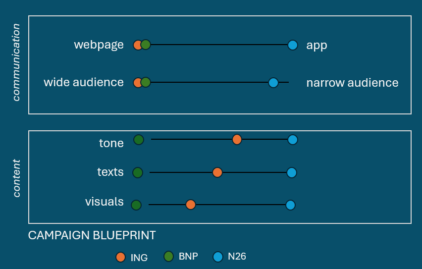

# Marketing Campaign Analysis of Belgian Banks

## 📄 Brief description

This project is part of an ING challenge at Becode-data science and AI bootcamp. Our mission is to develop an reproducible pipeline to compare marketing campaigns from competitor banks and ING. 
In our work we focus on:
- one traditional bank-BNP Paribas Fortis, and one neobank-N26
- campaigns in English, found on the webpages of the banks
- target audience: youth and individuals


## 🎯 Core objectives & methodology 

### a. Objectives 
Our aim is to see whether: 
- belgian banks communicate differently their products 
- ING is closer to a traditional or a challenger bank

### b. Methodology
For a detailed methodology, please refer to the methodology.md
For this work we focused on three bank campaigns: ING, BNP Paribas Fortis and N26. 
For campaign comparisons we chose the tone, visual and text communication of pages. For those, we defined a list of features to be extracted (see features_listv01). 

1. We scraped URLs from the sitemap of each bank. To have more a targeted output, we banned the following terms from our URL scrape: "about us, legal, faq, news, articles, support, help, press".
We obtained URLs in FR, EN and NL in a json format. 
2. Feature extraction by LLM. 
3. Retained ENGLISH campaigns: 
- ING: we selected the URLs that have the word "campaign", "campagne"
- BNP: we selected the all the root URLs with a unique product 
- N26: we could only select the homepage and the debit card plans (this bank does not communicate through their webpage)
4. Data analysis on tone, visual and text features. 


## 🛠️ Tech stack 

|Tool               |       Function        |
|-------------------|-----------------------|
|Python             | Programming language  |
|                   |   LLM                 |
|Git/github         | version control       |


## 📁 Repo structure


## 💻 Installation 

1. Clone the repo to your local machine.

```
git clone https://github.com/patoobyte/banking-campaign-analysis 
cd banking-campaign-analysis
```

2. Create a virtual environment and install dependencies.
```
python -m venv env
source venv/bin/activate   
pip install -r requirements.txt
```

## 🌟 Main result 

- Belgian banks communicate differently: whether we take campaigns all together, or focus on a permanent produc, or a time limited offer. 
- Based on comparisons of ING, BNP and N26 on target audience, medium of communication with clients, tone, visuals and text, we observe that ING is a hybrid bank: 
- closer to traditional banks for communication features 
- closer to neobanks for context of their campaigns




## 🔍 Limitations and future outlooks

- In this project, only campaigns at the time of this study on the webpage of each banks were investigated. Through this work, we observed that neo-banks primarily use app to communicate time limited offers. To have a wider analysis, we would need to include social media campaigns, and campaigns available on the mobile applications of banks. 
- Additionally, to have a complete overview of the campaign success we would need to combine our data with internal data of the banks. This would allow us to identify features that make a campaign impactful. 
- From a technical aspect, the technical pipeline is not running on a schedule. Moving forward we would recommend to automatically run it once a month during low season, and once a week during high season to capture the most releavent news and stay up to date. 
- This prototype can now be enlarged to include additional banks of interest for comparison.
- Features can be customized to investigate campaign characteristics of interest. 


## ⌛Timeline 

This project was completed in two weeks. 

## 🔦 Credits 

The campaign analysis was developed by our team at Becode - data science and AI bootcamp: 
- [Sooyoung Lee](https://www.linkedin.com/in/sooyoung-lee-patoobyte/): repo manager/tech lead
- [Imad Laroussi Mseksef](https://www.linkedin.com/in/imad-laroussi-mseksef/): tech lead
- [Anna Diacofotaki](https://www.linkedin.com/in/anna-diacofotaki/): documentation/team lead